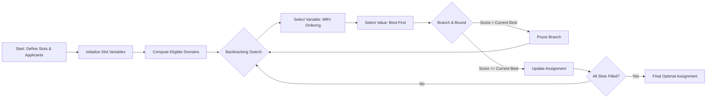

# easy-sched-reworked

Web app that helps university departments assign student Learning Assistants (LAs) and Undergraduate TAs (UTAs) to course sections - automatically, using a constraint solver, with admin override for the edge cases.

A redesign of a university capstone project, rebuild to hit the original stretch goals: A real database instead of hardcoded data, a REST API, and a from-stratch scheduling algorithm.

Original GW CSCI 4243W/4244, Fall 2024/Spring 2025 - [project page](https://gw-cs-sd-24-25.github.io/sd-cow/)

## Features

- **Automated assignment solver** - given applicants, sections, and position requirements, computes an assignment that maximizes overall fit
- **Eligibility engine** - hard constraints (GPA floors, scheduling conflicts) are checked separately from soft scoring, so "can this person take this slot" and "how good a fit are they" never get conflated
- **Pluggable scoring** - swap in different weighting schemes without touching the solver
Admin locks & blocks - pin a specific applicant to a slot, or ban one, overriding the algorithm when policy requires a human call
- **Multiple workspaces** - each dataset query param is an isolated, independently-seeded sandbox, so you can compare scenarios side by side
- **Drag-and-drop board view** - visualize and adjust assignments directly in the browser
- **Auto-generated API docs** - FastAPI's Swagger UI at /docs, no extra work required

## Tech Stack

### Backend

- FastAPI - REST API layer
- SQLAlchemy + SQLite - persistence
- Pydantic - request/response validation
- pytest - test suite

### Frontend

- React 19+ TypeScript
- Vite - dev server / build
- Tailwind CSS v4 - styling
- @dnd-kit - drag-and-drop board

## How the Solver Works

The core problem is modeled as a Constraint Satisfaction Problem:



- **Variables:** one per open position slot (a section needing 2 LAs + 1 UTA contributes 3 slots)
- **Domains:** applicants who pass eligibility for that slot, paired with a fit score
- **Search:** backtracking with MRV (fill the most-constrained slot first) and best-first value ordering (try the best candidate first)
- **Pruning:** branch-and-bound cuts off partial assignments that can't beat the best solution found so far
- **Safety valve:** a node budget guards against worst-case blowup on large inputs; if hit, the best-so-far solution is returned and flagged as possibly non-optimal

## What I Learned

- Designing a CSP from scratch - turning a real scheduling problem into variables/domains/constraints, and picking heuristics (MRV, best-first, branch-and-bound) that actually matter for performance
- Separating hard constraints (eligibility) from soft constraints (scoring) as distinct systems, rather than one tangled scoring function
- Structuring an API around isolated, on-demand "workspaces" instead of one global mutable dataset
- Building admin override mechanics (locks/blocks) that coexist with an automated algorithm instead of fighting it
- Wiring a typed React frontend to a FastAPI backend end-to-end, including drag-and-drop state that stays in sync with the server

## Getting Started

### Backend

```bash
cd backend
pip install -r ../requirements.txt
uvicorn api:app --reload --port 8000
```

API docs: https://127.0.0.1:8000/docs

### Frontend

```bash
cd frontend
npm install
npm run dev
```

App: https://localhost:5173

### Tests

```bash
cd backend
pytest
```

## Project Structure

```text
├── backend/
│   ├── api.py                  # FastAPI routes
│   └── ta_assignment/
│       ├── csp_solver.py       # Backtracking solver
│       ├── scoring.py          # Eligibility + scoring
│       ├── locks.py            # Admin overrides
│       ├── scheduling.py       # Conflict detection
│       └── db/                 # Models, repository, seeding
├── frontend/
│   └── src/
│       ├── components/         # Views (Sections, Applicants, Board, Solver...)
│       └── lib/api.ts          # API client
└── requirements.txt
```

### Roadmap

- [ ] Persist scoring config per-department instead of hardcoded defaults
- [ ] Export finalized assignments (CSV/PDF)
- [ ] Auth for multi-admin use

### License

MIT
